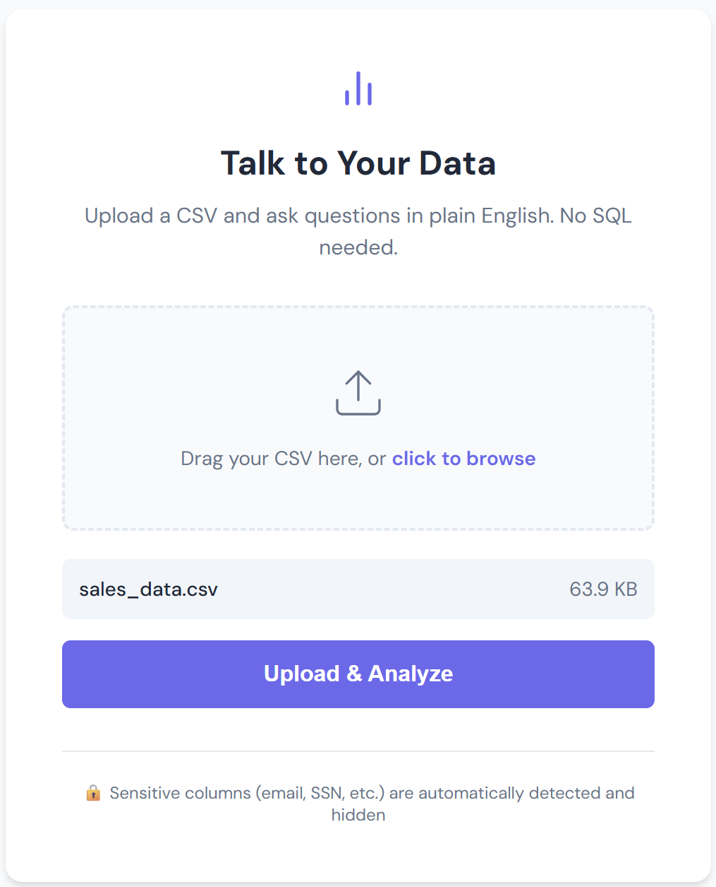
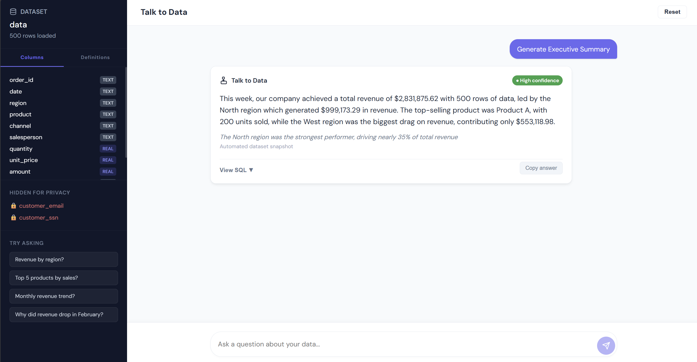
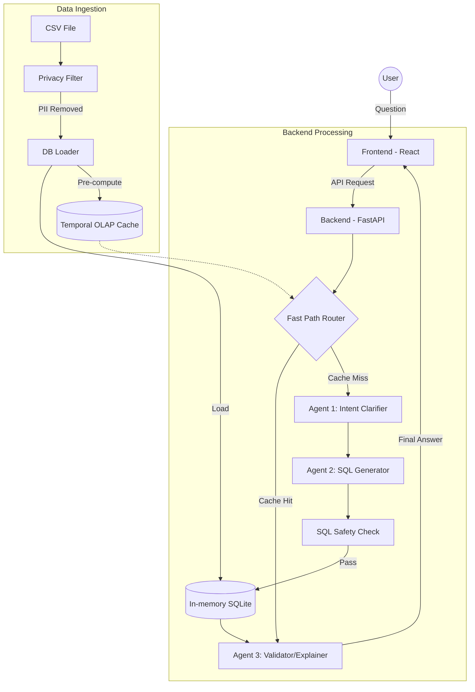

<div align="center">

#  Talk to Data

**Ask questions about your data in plain English. Get instant, verified answers.**

<br/>

[](https://python.org)
[](https://react.dev)
[](https://fastapi.tiangolo.com)
[](https://groq.com)
[](https://sqlite.org)

<br/>

[🚀 Quick Start](#-quick-start) • [✨ Features](#-features) • [🎨 See It In Action](#-see-it-in-action) • [🏗️ Architecture](#-architecture) • [🔌 API Reference](#-api-reference) • [⚠️ Limitations](#-limitations)

</div>

---

<div align="center">

&nbsp;&nbsp;&nbsp;[](https://caring-elegance-production-1386.up.railway.app)&nbsp;&nbsp;&nbsp;[](https://github.com/shabdagya/talk-to-data)

</div>

---

## 👥 Team

> **Gradient Descenters**

| Role | Member |
|------|--------|
| 🧑‍💻 Team Leader | [@Shriya](https://github.com/shrrrriya) |
| 🧑‍💻 Member | [@Shabdagya](https://github.com/shabdagya) |
| 🧑‍💻 Member | [@Dhruv](https://github.com/Dhruv-Tuteja) |
| 🧑‍💻 Member | [@Dhanu](https://github.com/dhanubansal777) |

---

## ✨ Features

<table>
<tr>
<td>🗣️ <b>Natural Language Querying</b></td>
<td>Ask questions like <i>"What was revenue by region in Q3?"</i> and get data-backed answers instantly — no SQL needed.</td>
</tr>
<tr>
<td>🤖 <b>Three-Stage AI Agent Pipeline</b></td>
<td>Intent Clarifier → SQL Generator → Validator/Explainer. Each agent specializes in one job for maximum accuracy.</td>
</tr>
<tr>
<td>🔒 <b>Automatic PII Detection & Removal</b></td>
<td>Columns like <code>email</code>, <code>ssn</code>, <code>password</code>, <code>phone</code> are stripped automatically before the AI ever sees them.</td>
</tr>
<tr>
<td>✨ <b>One-Click Executive Summary</b></td>
<td>Runs four batch analytics queries and returns a 3-sentence professional business brief in one click.</td>
</tr>
<tr>
<td>📖 <b>Metric Definition Dictionary</b></td>
<td>Business terms like "revenue" and "refund rate" map to precise SQL formulas — always consistent, always correct.</td>
</tr>
<tr>
<td>🔍 <b>SQL Transparency</b></td>
<td>Every answer shows the exact SQL query it ran, plus a plain-English explanation of that query.</td>
</tr>
<tr>
<td>⚡ <b>Temporal Date Awareness</b></td>
<td>The backend detects the dataset's date range and injects it into the AI context to prevent hallucinated time references.</td>
</tr>
<tr>
<td>🛡️ <b>SQL Safety Layer</b></td>
<td>All generated SQL is sanitized to block <code>DROP</code>, <code>DELETE</code>, <code>UPDATE</code>, and <code>INSERT</code> before execution.</td>
</tr>
</table>

---

## 🚀 Quick Start

### Prerequisites

- **Python 3.10+**
- **Node.js 18+** and **npm**
- A free [Groq API key](https://console.groq.com/)

### 1️⃣ Clone the Repository

```bash
git clone https://github.com/shabdagya/talk-to-data.git
cd talk-to-data
```

### 2️⃣ Set Up the Backend

```bash
cd backend

# Create and activate a virtual environment
python3 -m venv venv
source venv/bin/activate

# Install dependencies
pip install -r requirements.txt
```

Create a `.env` file inside `backend/`:

```bash
GROQ_API_KEY=your_groq_api_key_here
```

Start the backend:

```bash
uvicorn main:app --reload --port 8000
```

> API available at `http://localhost:8000`

### 3️⃣ Set Up the Frontend

```bash
cd frontend
npm install
npm run dev
```

> App opens at `http://localhost:3000`

### 4️⃣ Try It With Sample Data

A ready-to-use dataset is already included in the repo at [`sample_data/sales_data.csv`](https://github.com/shabdagya/talk-to-data/blob/main/sample_data/sales_data.csv). Just upload it directly on the app to get started instantly.

> 💡 **Tip:** This is the recommended way to explore the app — it has regions, products, channels, and dates so all example queries work out of the box.

If you'd rather regenerate it fresh:

```bash
cd sample_data
python generate_data.py
```

---

## 🎨 See It In Action

<div align="center">


<br/><sub><b>📂 CSV Upload with automatic PII Detection</b></sub>

<br/><br/>


<br/><sub><b>💬 Chat Interface with Executive Summary</b></sub>

</div>

---

## 🎨 See It In Action

<div align="center">


<br/><sub><b>📂 CSV Upload with automatic PII Detection</b></sub>

<br/><br/>


<br/><sub><b>💬 Chat Interface with Executive Summary</b></sub>

</div>

---

## 🏗️ Architecture

The system uses a **multi-layered agentic pipeline** with a pre-computed temporal caching layer and robust privacy controls.



### 1️⃣ Data Ingestion & Security

| Component | File | Responsibility |
|-----------|------|----------------|
| 🔒 Privacy Filter | `core/privacy_filter.py` | Automatically detects and strips PII (SSNs, emails, names) before data is stored |
| 🗄️ DB Loader | `core/db_loader.py` | Manages in-memory SQLite lifecycle and session state |
| ⚡ Temporal OLAP Cache | `core/db_loader.py` | Pre-computes min/max/mean/sum/std across Month, Quarter, Year at upload time — enables sub-millisecond temporal responses |

### 2️⃣ Multi-Agent Query Pipeline

Powered by **Groq (LLaMA 3.3 70B)** — a sequential chain where each agent has one job:

| Agent | File | Role |
|-------|------|------|
| 🚦 Fast Path Router | `main.py` | Intercepts questions matching pre-computed cache stats — skips SQL generation entirely |
| 🧠 Agent 1: Intent Clarifier | `agents/intent_clarifier.py` | Disambiguates questions, maps "business speak" to column names |
| 💡 Agent 2: SQL Generator | `agents/sql_generator.py` | Translates clarified intent into optimized SQLite syntax |
| 🛡️ SQL Safety Auditor | `core/sql_safety.py` | Blocks injection; enforces read-only queries |
| ✅ Agent 3: Validator/Explainer | `agents/validator.py` | Executes query, returns **natural language answer** + **confidence score** + **key insight** |

### 3️⃣ Business Logic & Frontend

| Component | File | Role |
|-----------|------|------|
| 📐 Metric Dictionary | `core/metric_dict.py` | Central repo of business formulas (Revenue, Profit Margin, etc.) — ensures consistent LLM logic |
| ⚛️ Next.js App | `frontend/` | Chat-like interface with Shadcn UI components and Recharts visualizations |

### 🔒 Security Posture

| Guarantee | How |
|-----------|-----|
| **Zero-Persistence** | Data lives only in-memory; wiped on session reset or server restart |
| **Automated Anonymization** | PII blocklist prevents sensitive data from reaching the query engine or LLM |
| **Read-Only Enforcement** | Execution layer + safety auditor forbid `INSERT`, `UPDATE`, `DELETE`, `DROP` |

---

## 🔌 API Reference

**Upload a CSV:**
```bash
curl -X POST http://localhost:8000/upload \
  -F "file=@sales_data.csv"
```

**Ask a question:**
```bash
curl -X POST http://localhost:8000/query \
  -H "Content-Type: application/json" \
  -d '{"question": "What is total revenue by region?"}'
```

**Example response:**
```json
{
  "answer": "The North region leads with $312,000 in revenue, followed by East at $289,000.",
  "confidence": 0.92,
  "confidence_label": "High",
  "key_insight": "North outperforms South by 55%.",
  "sql_used": "SELECT region, SUM(...) AS revenue FROM data GROUP BY region",
  "results": [
    {"region": "North", "revenue": 312000},
    {"region": "East",  "revenue": 289000}
  ]
}
```

**Other endpoints:**
```bash
curl http://localhost:8000/metrics   # Get metric definitions
curl http://localhost:8000/health    # Health check
```

---

## 🛠️ Tech Stack

| Layer | Technology |
|-------|------------|
| **Frontend** | Next.js, Shadcn UI, Axios, Recharts, Tailwind CSS |
| **Backend** | Python, FastAPI, Uvicorn |
| **Database** | SQLite (in-memory, per session) |
| **Data Processing** | Pandas |
| **AI / LLM** | Groq API — LLaMA 3.3 70B Versatile |
| **Validation** | Pydantic |

---

## ⚠️ Limitations

- **Session-only memory** — Data resets when the backend server restarts.
- **Single file per session** — Uploading a new file replaces the previous one.
- **English-only queries** — The agent pipeline has only been tested with English.
- **Sales-optimized metrics** — Predefined formulas work best for sales/e-commerce datasets.
- **Date column assumption** — Temporal queries assume a `date` column in `YYYY-MM-DD` format.

---

## 🔮 Future Improvements

- 🔁 **Multi-step analytical agent loop** — Let the AI run follow-up queries automatically for root-cause analysis
- 📁 **Multi-file + JOIN support** — Query across multiple datasets simultaneously
- 💾 **Persistent storage** — Replace in-memory SQLite with PostgreSQL
- 📤 **Export to PDF/CSV** — Export chat history and AI insights as a report
- ⚙️ **Custom metric definitions** — Define your own business formulas through the UI

---

<div align="center">
<sub>Built with ❤️ by <b>Gradient Descenters</b></sub>
</div>
